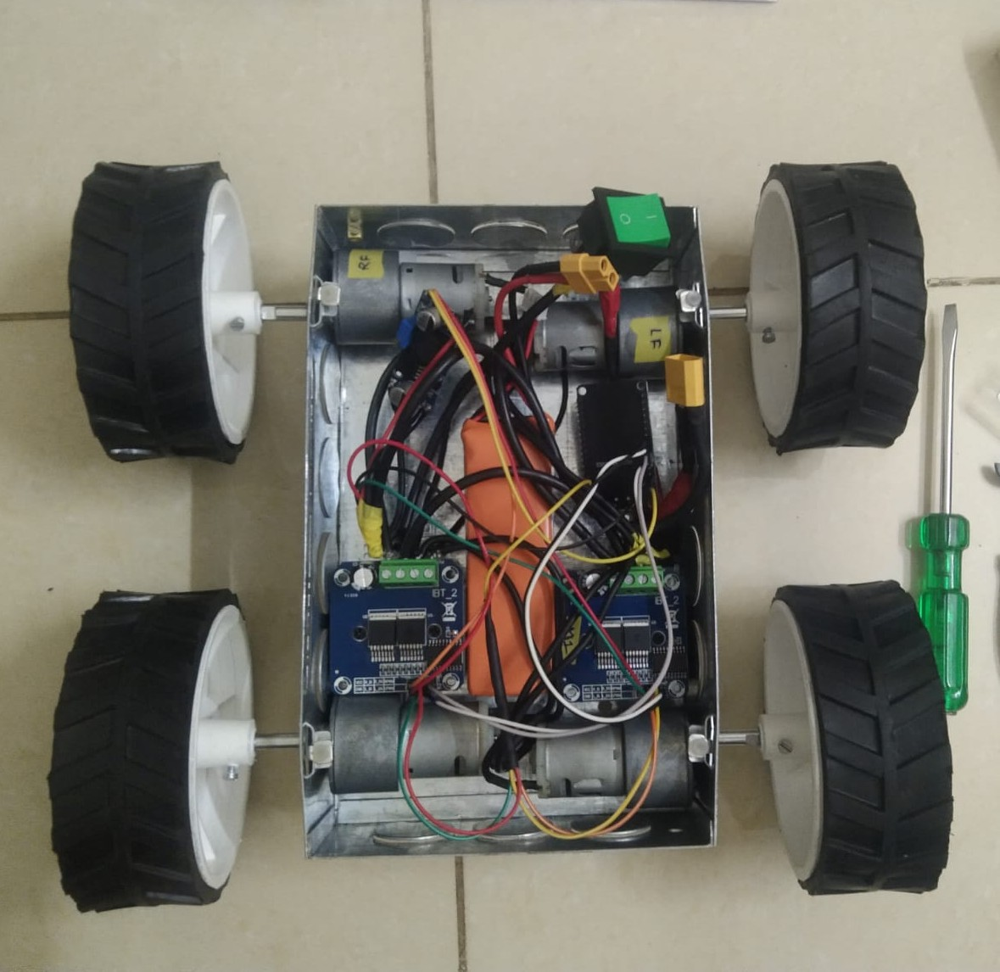
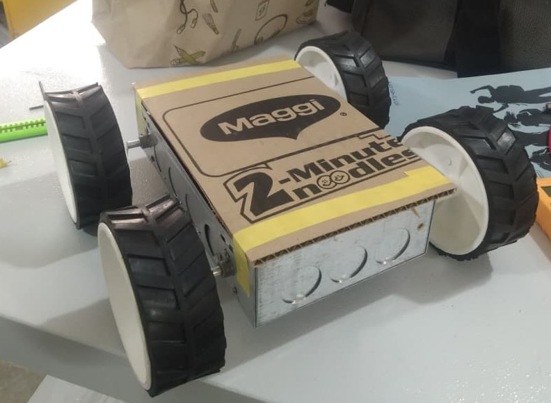
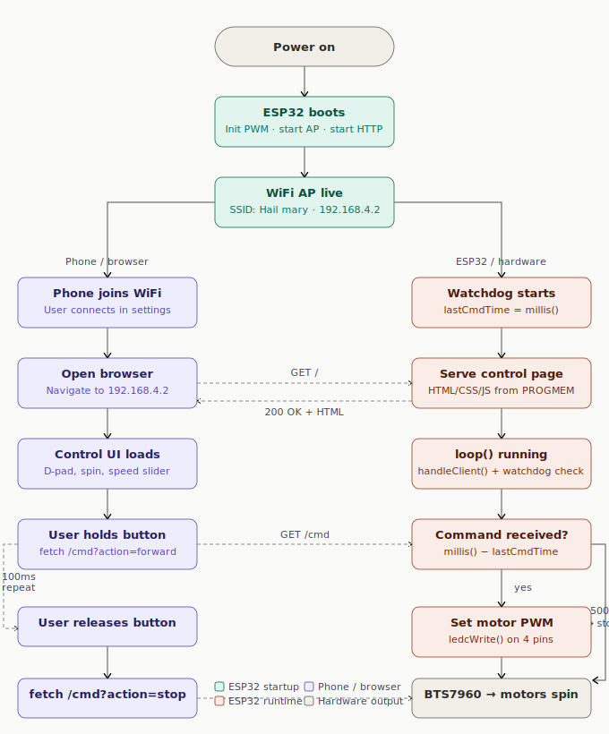

# Fail Mary — WiFi RC Car Controller

**Fail Mary** is an ESP32-powered WiFi-controlled RC car built for a last-minute obstacle course competition. The ESP32 hosts its own wireless network and a browser-based controller, letting any phone drive the robot without a dedicated app or internet connection. After an unfortunate hardware failure on competition day gave it its name, the project was rebuilt into a reliable embedded platform focused on simplicity, safety, and extensibility.

---

## The story

We built this robot in a rush in the days before an RC obstacle course competition. We'd just watched *Project Hail Mary*, so the name felt appropriate — a last-minute attempt to get everything working before the event.

During final testing just before registration, both BTS7960 motor drivers failed due to a short circuit. When we reached the registration desk and were asked for the robot's name, we didn't hesitate: **Fail Mary**.

After the competition we sourced replacement drivers, rewrote the firmware with proper reliability features — a dead-man watchdog, corrected turn logic, better command handling — and brought the robot back to life. The name stuck.

---

## Photos

### Internal electronics



### At the competition



### Demo

https://github.com/ashishjitarwal/fail-mary/blob/main/demo.mp4


## Features

- ESP32 hosts its own WiFi AP — no router, no internet needed
- Full control UI served directly from the ESP32's flash memory
- Works in any phone browser — no app install required
- Hold-to-move D-pad with forward, reverse, arc turns, and in-place spin
- Adjustable PWM speed slider — changes take effect immediately, mid-movement
- Dead-man watchdog — motors stop automatically if connection drops
- 20 kHz PWM frequency — above the audible range, safe for BTS7960

---

## How it works

Access Point mode was chosen deliberately so the robot works anywhere — a competition floor, a carpark, a hallway — without depending on an external WiFi network or a custom mobile app.

```
Phone browser  →  WiFi (AP mode)  →  ESP32 HTTP server  →  BTS7960 drivers  →  Motors
     ↑                                       |
     └───────────────── "OK" ────────────────┘
```

The ESP32 creates a private network. When you connect your phone and visit `192.168.4.2`, the ESP32 serves the full control page from PROGMEM. Buttons on the page fire HTTP requests back to the ESP32, which translates them into PWM signals to the motor drivers. A dead-man watchdog on the ESP32 stops the motors if no command arrives within 500ms.



---

## Hardware

| Component | Details |
|---|---|
| Microcontroller | ESP32 Dev Module |
| Motor drivers | 2× BTS7960 (one per side) |
| Motors | 4× Johnson 12V 200RPM (2 per side) |
| Power | 3S LiPo (11.1V) for motors; LM2596 buck converter → 5V for drivers; ESP32 runs from 5V via its onboard regulator |

> **Design note:** Every component was chosen to be inexpensive and individually replaceable. When the original drivers failed at the competition, sourcing replacements was straightforward because nothing in the BOM is exotic.

### Wiring

```
Driver 1 — LEFT side
  RPWM  ←  GPIO 25   (left forward)
  LPWM  ←  GPIO 26   (left reverse)
  R_EN  ←  3.3V (always enabled)
  L_EN  ←  3.3V (always enabled)
  VCC   ←  5V  (from LM2596)
  GND   ←  Common GND
  B+    ←  11.1V LiPo positive
  B-    ←  Common GND

Driver 2 — RIGHT side
  RPWM  ←  GPIO 27   (right forward)
  LPWM  ←  GPIO 14   (right reverse)
  R_EN  ←  3.3V
  L_EN  ←  3.3V
  VCC   ←  5V
  GND   ←  Common GND
  B+    ←  11.1V LiPo positive
  B-    ←  Common GND
```

> **Note on right-side motor polarity:** The right-side motors are wired with their polarity physically reversed (M+ → motor −, M− → motor +). The driver's "forward" direction already spins the right wheels correctly without needing to swap commands in software.

---

## Software setup

### Requirements

- [Arduino IDE](https://www.arduino.cc/en/software) 2.x or later
- ESP32 board package by Espressif — install via **Boards Manager**, search `esp32`
- **ESP32 Arduino core v3.x** — this sketch uses the v3 `ledcAttach()` API. If you have v2.x, update it or replace `ledcAttach()` with the v2 `ledcSetup()` / `ledcAttachPin()` pair

### Flash the firmware

1. Open `src/fail_mary.ino` in Arduino IDE
2. Select **ESP32 Dev Module** as the board
3. Connect the ESP32 via USB and select the correct port
4. Click **Upload**

### Connect and drive

1. On your phone, connect to WiFi:
   - **Network:** `Fail mary`
   - **Password:** `signofthetimes`
2. Open a browser and go to `http://192.168.4.2`
3. The control page loads — no internet required

---

## Controls

The control page is designed for landscape orientation on a phone, split into two halves.

**Left side — D-pad**

| Button | Behaviour |
|---|---|
| FWD | Both sides forward at current speed |
| BWD | Both sides reverse at current speed |
| LEFT | Right side drives, left side stopped — wide arc left |
| RIGHT | Left side drives, right side stopped — wide arc right |
| STOP (centre) | Immediately cuts all motor power |

**Right side — Spin + Speed**

| Control | Behaviour |
|---|---|
| CCW spin | Left reverse, right forward — spins in place counter-clockwise |
| CW spin | Left forward, right reverse — spins in place clockwise |
| Speed slider | Sets motor PWM (0–255). Changes take effect immediately, even mid-movement |

All directional buttons are hold-to-move: motors run while held and stop the moment you release. STOP is a one-shot that cuts power immediately regardless of any held button.

---

## Configuration

Everything you might want to change is near the top of `fail_mary.ino`:

```cpp
// WiFi credentials
const char* SSID     = "fail mary";
const char* PASSWORD = "signofthetimes";

// GPIO pins
#define LEFT_RPWM   25
#define LEFT_LPWM   26
#define RIGHT_RPWM  27
#define RIGHT_LPWM  14

// PWM — 20kHz is above the audible range and safe for BTS7960
#define PWM_FREQ  20000
#define PWM_RES   8       // 8-bit → 0–255

// Default speed on load
int motorSpeed = 200;

// Dead-man timeout in milliseconds
#define WATCHDOG_MS 500
```

---

## Reliability fixes (v1.1)

Applied after the initial build to make the car stable enough for regular use.

**Dead-man watchdog** — the ESP32 tracks the timestamp of the last received command. If `WATCHDOG_MS` passes without a command, `stopAll()` is called. The browser UI also turns the status dot red when fetches stop being acknowledged. A dropped connection, closed tab, or phone going to sleep can never leave motors running indefinitely.

**Turn vs spin corrected** — `turnLeft` and `turnRight` previously had the same implementation as `spinLeft`/`spinRight`. They now correctly drive one side forward while stopping the other, giving a wide arc rather than an in-place spin.

**Immediate speed response** — `handleSpeed()` calls `applyCurrentCmd()` after updating `motorSpeed`, so the slider takes effect mid-movement without releasing and re-pressing a button.

**Fetch backlog prevention** — the JS `hold()` timer checks an `inFlight` flag before each send. If the previous HTTP request is still pending, that tick is skipped, preventing a command queue from building up on slow connections.

**Stop button touch fix** — the stop button's `ontouchend` was set to `void(0)`, causing a synthetic mouse event to fire on mobile and double-trigger. Changed to `return false`.

---

## Known limitations

These are intentionally deferred. The car runs and is stable — these are next steps, not current problems.

- **HTTP instead of WebSocket** — each button send is a new HTTP request. WebSocket would give a persistent connection with lower latency, noticeable on congested networks.
- **No battery monitoring** — a voltage divider from the LiPo to the ESP32 ADC could feed a low-battery indicator into the UI.
- **No current sensing** — the BTS7960 has IS pins that signal motor current. Wiring these to the ADC would allow stall detection and auto-cutoff.
- **No OTA updates** — firmware changes require a USB cable. `ArduinoOTA` would allow flashing over WiFi.
- **No analog joystick UI** — the D-pad gives binary speed. A virtual joystick would allow variable speed from thumb position.
- **No encoder feedback** — open-loop only. Wheel encoders and a PID loop would allow straight-line correction and odometry.

---

## Project structure

```
fail_mary/
├── src/
│   └── fail_mary.ino   # Full firmware — ESP32 code + embedded HTML/CSS/JS
├── flowchart.svg        # System flowchart (embedded in this README)
├── electronics.jpeg     # Internal electronics photo
├── robot.jpeg           # Competition photo
├── demo.mp4             # Motor demo video
└── README.md
```

The HTML control page lives inside `fail_mary.ino` as a raw string literal stored in PROGMEM and served directly by the ESP32's HTTP server. No separate files or build step needed.

---

## Contributors

Built as a team for a university RC obstacle course competition.

| Contributor | Role |
|---|---|
| [Ashish](https://github.com/ashishjitarwal) | Hardware, electrical wiring |
| [@brijeshthilakofficial](https://github.com/brijeshthilakofficial) | Firmware, web interface, documentation |
| [@aditya71206](https://github.com/aditya71206) | Mechanical chassis, assembly |
| [@Greyspel](https://github.com/Greyspel) | Testing, competition logistics |

---

## Acknowledgements

Inspired by Andy Weir's *Project Hail Mary*. Despite earning the nickname Fail Mary on competition day, the robot came back better for everything that went wrong.

---

## License

MIT — do whatever you like with this. If you build something cool on top of it, a mention is appreciated but not required.
